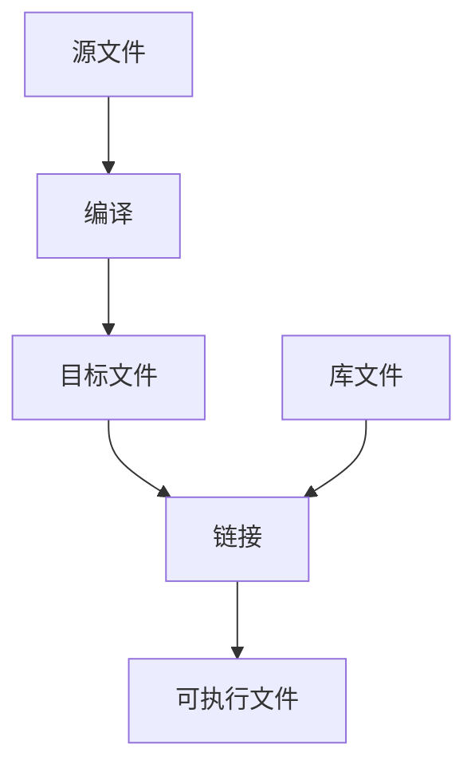

# 认识计算机

## 从 `hello world` 程序开始

1. 进入终端使用 `vi` 创建 01hello.c 文件

    ```sh
    $ vi 01hello.c
    ```

    文件内容如下:

    ```c
    #include <stdio.h>

    int main(void)
    {
        printf("hello world\n");
        return 0;
    }
    ```

2. 接下来使用 `gcc` 命令生成 `a.out` 文件

    ```sh
    $ gcc 01hello.c
    ```

    以上我们创建了一个文件，并使用 `gcc` 生成了 `a.out` 文件，其中：
    * `01hello.c`: 是一个文本文件
    * `a.out`: 是一个可执行文件

3. 执行 `a.out` 文件

    ```sh
    $ ./a.out # 输出 hello, world
    ```

## 程序的定义

* 程序就是一组计算机能识别和执行的**指令**的**有序集合**。

  * 指令是计算机内部已经编写好的一些功能，比如加法、减法等
  * 有序集合：计算机中的cup中的指令是有限的，它实现的功能也是有限的，但是我们可以通过有序的将这些指令通过一些逻辑组合在一起那么就可以实现复杂的功能
* 程序是将人的逻辑、人的旨意传达给计算机，让计算机执行。
* 程序仅仅是电脑磁盘上的文件

## 程序语言

* 机器语言
* 汇编语言
* 中级语言：C 语言，既能编写**系统软件**、也能编写**应用软件**
* 高级语言：C++、JAVA、C# 等

## 程序语言的类型

* 编译型: 一次性翻译为机器语言(C、C++)
* 解释型: 一行一行发翻译为机器语言(JAVA)

## 编译程序

将其它语言翻译为机器语言的过程称为编译

1. 首先我们编写一些 C 语言的源文件
2. 然后使用 gcc 进行编译，使用 gdb 进行调试
3. 在编译后会生成目标文件(.o文件),一个程序可能包含多个 .o 文件
4. 将 .o 文件以及一些库文件进行链接
5. 最终生成可执行文件



### 编译链接的步骤

* 预处理(Pre-Processing)
* 编译(Compiling)
* 汇编(Assembling)
* 链接(Linking)


## ELF 文件类型

* 可重定位目标文件(Relocatable File)
这类文件包含了代码和数据，可以被用来链接成可执行文件或共享目标文件，静态链接也可以归为这一类。如 .o, .a 文件

* 可执行目标文件(Executable File)
这类文件包含了可以直接执行的程序，它的代表就是 ELF 文件。如 /bin/bash 文件

* 共享目标文件(Shared Object File)
这类文件包含了代码和数据，可以在以下两种情况下使用，一种是连接器可以使用这种文件跟其它的可重定向目标文件和共享目标文件链接，生成新的目标文件；第二种是动态连接器可以将几个这种共享目标文件与可执行文件结合，做为进程映像的一部分来允许。如 .so

* 核心转储文件(Core Dump File)
当进程意外终止时，系统可以将进程的地址空间内容及终止时的一些其它信息转储到核心转储文件中。如 Core dump 文件

## C 程序的执行环境

### 软件环境

* 加载器(exec系列函数)
    当执行 `./a.out` 的时候 `bash` 就会调用操作统的 `exec` 系列函数加载可执行程序，它将程序中的段加载至内存中对应的位置，这些段包含有：
  * ELF文件头
  * 程序头
  * 代码段(只读r/o)
  * 数据段(可读写r/w)
  * ...

### 内存分段图

| 内核虚拟存储器 |
|:---:|
|栈|
|共享存储器的映射区|
|堆|
|未初始化的数据端(.bss)|
|已初始化的数据段(.data)|
|代码段|
|保留|