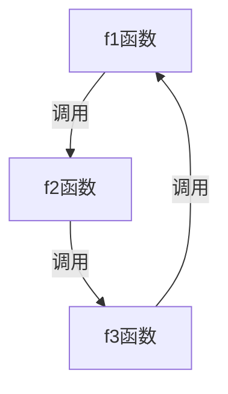

# 函数

* 函数是独立的一段程序
* 函数执行一个具体的、明确定义的任务
* 函数易于编写、理解、调试和维护
* 通常将需要多次执行的一段代码定位为函数

## 函数的分类

* `main` 函数：它是程序的入口
* 库函数：
  * 它是 ANSI C 定义的标准函数
  * 第三方库函数
* 自定义函数：自己编写的函数

## 函数的定义

```c
类型 函数名(类型 参数1, 类型 参数2, ...)
{
    函数体;
    return 表达式;
}
```

当函数执行到 `return` 语句或 `}` 时，函数运算停止。

可以用 `void` 定义函数的返回值，这表示定义的函数不会返回任何结果。

在函数的参数列表里的参数叫做**形式参数**

### 函数调用

* 函数调用的一般形式为：函数名(实际参数表)
* 调用函数时，提供的实参类型与数目必须匹配

下面是一个简单的函数调用示例：
```c
#include <stdio.h>

int add(int a, int b);
int main(void)
{
    int a = 10, b = 20;
    int sum = add(a, b);
    printf("a + b = %d\n", sum);
    return 0;
}

int add(int a, int b) 
{
    int sum = a + b;
    return sum;
}
```


猜数游戏：
```c
#include <stdio.h>
#include <stdlib.h>
#include <ctype.h>
#include <time.h>

void guess(int number);
int next();
int getnumber();

int main(void)
{
    srand(time(NULL));
    do {
        int unknow = rand() % 100 + 1;
        guess(unknow);
    } while(next());

    return 0;
}

void guess(int number)
{
    int count = 0;
    do {
        int guess_number = getnumber();
        if (guess_number > number)
        {
            printf("Too high\n");
        } 
        else if (guess_number < number)
        {
            printf("Too low\n");
        } else {
            printf("Congratulation. you win!\n");
            break;
        } 
    } while(++count != 10);
}

int next() 
{
    int c;
    printf("Next game?(y/n)：");
    while(isspace(c = getchar()))
        ;

    if (c == 'y')
        return 1;
    return 0;
}

int getnumber() 
{
    int n;
    while(1)
    {
        printf("Your guess: ");
        if (scanf("%d", &n) != 1 || n < 1 || n > 100)
        {
            printf("wrong number, need a number 1 ~ 100\n");
            while(getchar() != '\n')
                ;
        }
        else {
            break;
        }
    }

    return n;
}
```

### 函数的嵌套调用
函数的嵌套调用是指，在执行被调用函数时，被调用函数又调用了其它函数，以此类推。
```c
int main(void)
{
    f1();
    return 0
}

void f1()
{
    f2();
}

void f2()
{
    f3();
}
```

### 函数递归
一个函数在他的函数体内调用它自身则称这个函数为递归调用。这种函数称为递归函数。
递归函数可以分为两种：直接递归和间接递归

* 直接递归


* 间接递归


#### 递归示例
**利用递归求阶乘**
```c
#include <stdio.h>

unsigned int factorial(unsigned int n);
unsigned int factorial2(unsigned int n);

int main(void)
{
    printf("factorial(5)=%u\n", factorial(5));
    return 0;
}

unsigned int factorial(unsigned int n)
{
    if (n == 0)
        return 1;
    return n * factorial(n-1);
}
// 使用循环实现
unsigned int factorial2(unsigned int n)
{
    int result = 1;
    for (int i = n; i > 0; i--)
    {
        result *= i;
    }
    return result;
}
```