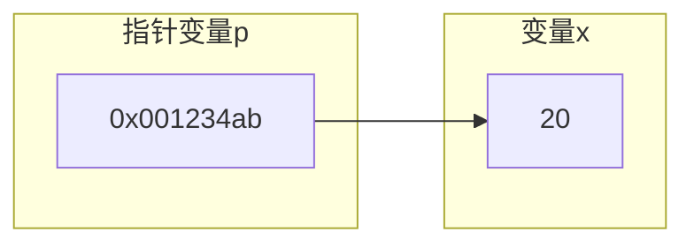
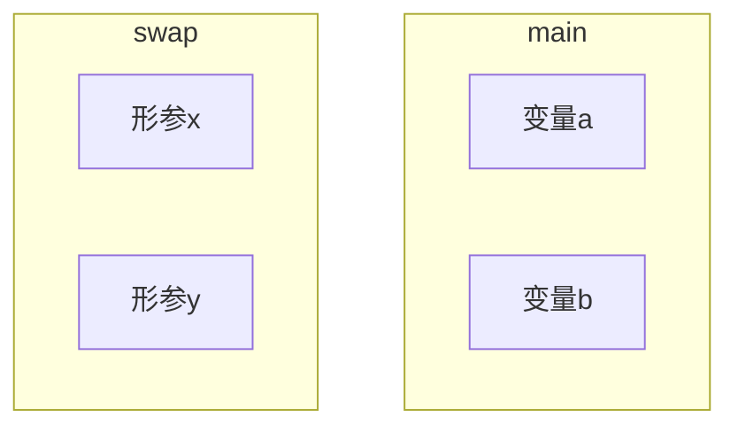
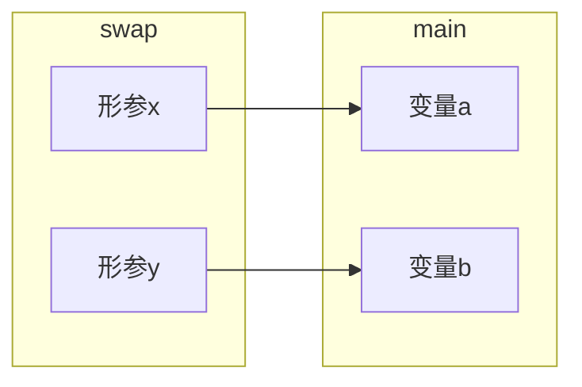
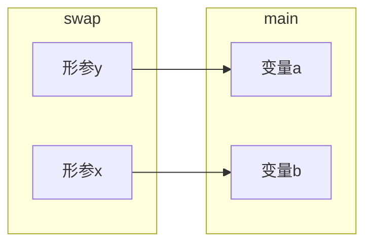

# 指针

* 什么是指针
* `&`和`*`运算符
* 指针与函数参数
* 空指针
* 通用指针
* 指针算术运算

## 什么是指针

在程序执行中的所有数据都保存与内存中，占用了内存中的一部分内存单元。内存单元按顺序排列，每个单元都有一个编号地址，内存中的数据都是通过地址访问的。

指针是一种特殊的变量，它所保存的值是另一个变量的内存地址。如下图所示：



下面是简单使用指针的示例：

```c
#include <stdio.h>
#include <stdlib.h>

int main(void)
{
    int x = 10;
    int* p = &x;

    printf("%d\n", x);
    printf("%p\n", &x);
    printf("%p\n", &p);

    p = (int*)malloc(sizeof(int));
    printf("%p\n", &p);

    return 0;
}
```

## `&`和`*`运算符

* `&` 运算符，用于取一个对象的地址
* `*` 是间接寻址，用于访问指针所指向的对象，如：

    ```c
    int var = 12;
    int *p;
    p = &var;
    int temp = *p;  // 等价与temp = var
    ```

|&运算和*运算是一对互逆运算|||说明|
|--|--|--|--|
|&*ptr|&var|ptr|获得var的地址|
|*&var|*ptr|var|获得var的值|

### 指针做为函数参数

首先要精确一点，函数参数本质上都是**值传递**，所以对于下面的 `swap` 函数无法实现两个数的交互。

```c
#include <stdio.h>

void swap(int x, int y)
{
    int tmp = x;
    x = y;
    y = tmp;
}

int main(void)
{
    int a = 10, b = 20;
    swap(a, b);
    printf("a = %d\n", a);
    printf("b = %d\n", b);
}
```

在上面的代码中 `swap` 的两个形参 `x`,`y` 与 `main` 中的变量 `a`,`b` 分别在自己的堆栈上，有自己的内存空间，所以他们所在的地址各不相同，如下图所示，所以当交换 `x`,`y` 的值时并不会对 `a`, `b` 两个变量有任何影响。



接下来我们用指针修改下上面的代码：

```c
#include <stdio.h>

void swap(int *x, int *y)
{
    int tmp = *x;
    *x = *y;
    *y = tmp;
}

int main(void)
{
    int a = 10, b = 20;
    swap(&a, &b);
    printf("a = %d\n", a);
    printf("b = %d\n", b);
}
```

交互前内存示意图:



运行查看结果会发现 `a` 和 `b` 正确的进行了交换，我们来看下这里面发生了什么。

在这里面我们向 `swap` 函数传递了两个值，这两个值分别是变量 `a` 和变量`b` 的地址，然后在 `swap` 函数体中我们使用 `*` 运算符对 `x` 和 `y` 两个地址所指向的值进行了交换。所以虽然函数参数是值传递的我们依然可以完成两个数的交换。下面是交互后的内存示意图：



## 空指针

* 空指针 `NULL` 是一个特殊的指针，表示不指向任何东西。实际上他是用 `(void*)0` 表示的。

* `p = NULL` 和 `p = 0` 是等价的，在C语言中推荐使用前者。

* 不能对空指针进行解引用(*)

## 通用指针

`void*` 是通用指针，可以把任何类型的地址赋值给通用指针。

通过将指定类型的地址转换为通用指针，其地址不会发生改变，但是会丢失类型信息。

```c
int a = 10;
void* p = &a;
```

## 指针算术运算

* 指针只能进行加法和减法运算：+ - ++ -- += -=
* 两种形式：指针 ± 整数 或者 指针 - 指针
  * 指针与整数的加减结果还是指针，表示该指针指向的地址偏移了数个存储单元后的新地址(如果是char类型就是偏移1个字节，如果是int类型就是偏移4个字节)。

    ```c
    #include <stdio.h>
    int main(void)
    {
        int a = 10;
        int* p = a;
        printf("p = %p\n", p);
        p += 1;
        printf("p + 1 = %p\n", p);
    }
    ```

    ```mermaid
    flowchart LR
    subgraph stack
    direction TB
    a[0x1234]
    b[0x1235]
    c[0x1236]
    d[0x1237]
    end
    p --> |开始地址|a
    p --> |p += 1后的地址|d
    ```

  * 指针与指针间的运算要求，两个指针是同一类型，其结果是整数，**表示两个指针之间的数据的个数，不是两个地址的差值。**
