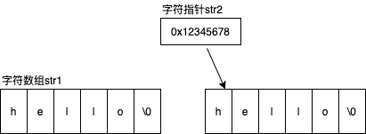

# 字符指针

* 字符指针
* 字符数组与字符指针的区别
* 字符串拷贝
* 指针与const
* 指针的使用原则

## 字符指针

C 语言中没有专门的字符串变量，可以用字符数组来保存字符串。如 `char str[]="hello"`，这里的 `str` 是字符数组变量，保存了字符串 "hello"。

除了使用字符数组，还可以使用**字符指针**来执行字符串常量。如： `char* str="hello"`，

* 这里的 `str` 是字符指针变量，它保存的是字符串 "hello" 的地址。
* 由于 `str` 指向的是字符串常量 "hello"，常量不能被修改，所以 `str[0]='W'` 这种写法是错误的。

下面是字符串数组与字符串指针的示例：

```c   
#include <stdio.h>

int main(void)
{
    char str1[] = "hello";
    char* str2 = "hello"

    printf("%d\n", sizeof(str1));
    printf("%d\n", sizeof(str2));

    str1[0] = 'W';
    // str2[0] = 'W' // cause a error.
    return 0;
}
```

## 字符数组与字符指针的区别

* 存储分配

    

  * 字符数组 `str1` 存储在堆栈上
  * 字符指针 `str2` 本身也存储在堆栈上，但是它所指向的字符串常量是存储在常量区
* 读写权限
  * 字符数组可读可写
  * 字符指针只能读不能修改
* 初始化
  * 字符数组初始化时直接保存字符串到分配的堆栈空间中
  * 字符指针初始化时仅仅是将常量区里的字符串的地址保存到变量 `str2` 中
* 执行效率
  * 字符数组是直接访问
  * 字符指针需先得到指针然后间接访问，所以更慢

## 字符串拷贝

```c
char * strcpy1(char* dest, const char* src)
{
    assert(dest != NULL && src != NULL);
    char* ret = dest;
    while((*dest++ = *src++) != '\0');
    return ret;
}

char * strcpy2(char* dest, const char* src)
{
    assert(dest != NULL && src != NULL);
    char* s = (char*)src;
    int delt = dest - src;
    while((s[delt] = *src++) != '\0');
    return ret;
}
```

> 全局 `const int n = 10` 存储于常量区，常量区是只读的，所以不能通过指针来进行改变
>
> 局部 `const int n = 10` 存储于堆栈区，而堆栈区是可读可写的，所以可以通过指针间接的改变 `n` 的值o

## 指针与const

* 指向常量的指针：`const int* p` 或 `int const* p`，这里可以把 `*p` 看成常量，也就是说可以改变指针变量 `p` 本身的值，但是指针 `p` 所指向的整形变量的值不可以被改变。

    ```c
    int n = 10;
    const int* p = &n;
    *p = 20;    // error
    printf("n=%d", n);
    int m = 100;
    p = &m;
    printf("m=%d", m);
    ```

* 指针常量：`int* const p`，这里可以把 `p` 看成常量，也就是说可以改变指针所执行的整形变量的值，但是不可以改变指针 `p` 本身的值。

    ```c
    int n = 10;  
    int* const p = &n;
    p = &n; // 第二次赋值失败
    *p = 100;
    ```

## 指针的使用原则

* 永远要清除指针指向了哪里
* 杜绝空悬指针和野指针
  * 空悬指针是指已经被销毁的对象或已经回收的地址
  * 野指针是指未初始化的指针
