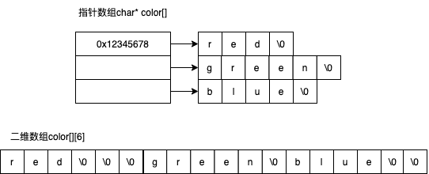
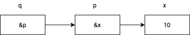

# 指针与数组

* 指针数组与数组指针
* 指针数组与二维数组
* 指针的指针

## 指针数组与数组指针

指针数组：就是其元素为指针的数组，其每个元素都是指针变量。其语法格式如下：
```c
数据类型* 指针数组名[常量表达式];
int* p[5];
char* color[] = {"red", "green", "blue"};
```

数组指针：就是一个指针变量，它指向一个数组。其语法格式如下：
```c
数据类型 (*指针数组名)[常量表达式];
int (*p)[5];

char color[][6] = {"red", "green", "blue"};
char (*pcolor)[6] = color;
for(int i = 0; i < 3; i++)
{
    pcolor[i]  = color[i];
}
```

下面用一张图更直观的看出指针数组与数组指针的区别：


## 指针的指针
* 指针比变量是用来存储**变量**的地址
* 指针的指针变量是用来存储**指针变量**的地址

```c
int x = 100;
int *p = &x;
int **q = &p;
```


### 指针的指针示例
```c
int find(const char* src, char ch, char** ret)
{
    assert(src != NULL);
    char* p = (char*)src;

    while(*p)
    {
        if (*p == ch)
        {
            *ret = p;
            return 1;
        }
        p++;
    }
    return 0;
}

int main(void)
{
    char str[] = "hello, world!";
    char *p = NULL;
    if (find(str, o, &p))
        printf("%s\n", p);
    return 0;
}
```

### 一些示例
```c
#include <stdio.h>

int main(void)
{
    char color[][6] = {"red", "green", "blue"};
    char (*p)[6] = color;
    char** q = color;
    pinrtf("%p\n", p);
    pinrtf("%p\n", q);
    pinrtf("%p\n", p[0]);
    pinrtf("%p\n", p[1]);
    pinrtf("%p\n", q[0]);
    return 0
}
```